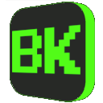

# BetterKick

**BetterKick** is a browser extension (Chrome/Edge) that allows you to download VODs (Video on Demand) from Kick.com directly as **MP4 files** with a single click. No command-line tools, no external websites, and no complex setup required.

## 🇬🇧 English

### 🚀 Key Features

*   **One-Click Download**: Adds a native-looking "Download MP4" button directly to the Kick video player interface.
*   **Direct MP4 Conversion**: Automatically converts Kick's HLS streams (.m3u8) into standard MP4 files on the fly, right within your browser.
*   **Memory Efficient**: Uses the File System Access API to write directly to your disk, ensuring even long streams download smoothly without crashing your browser.
*   **Persistent Progress**: If you resize the window or the DOM updates, the download state is saved so you never lose track.
*   **Global Progress Tracking**: Monitor download progress via the extension icon badge and the browser tab title (e.g., `[45%] Video Title`), visible even when switching tabs.
*   **Auto-Mute**: Automatically mutes the tab during download to prevent audio interference, restoring original settings afterwards.
*   **Smart Cleanup**: Automatically cleans up temporary files if a download is interrupted or the page is closed.
*   **Live Stream Download**: Adds a “Download Stream” button on live channels with cancel options to keep or discard progress.

### 📝 File Naming

*   **VOD downloads** default to `BETTERKICK - VOD TITLE - CHANNEL.mp4` (sanitized and limited to 255 characters).
*   **SR downloads** default to `BETTERKICK - STREAM TITLE - CHANNEL.mp4`.
*   **You can edit the name** in the Save dialog before downloading.
*   **Live stream downloads** show a suggested name in the Save dialog.

### 📥 Installation (Manual / Developer Mode)

Since this extension is not published in the Web Store, you need to install it manually:

1.  **Download** this repository:
    *   Click on the green **Code** button -> **Download ZIP**.
    *   Unzip the file into a folder.
2.  Open your browser's extension manager:
    *   **Chrome**: Go to `chrome://extensions/`
    *   **Edge**: Go to `edge://extensions/`
3.  Enable **Developer mode** (toggle switch usually located at the top right corner).
4.  Click the **Load unpacked** (Chrome) or **Load unpacked extension** (Edge) button.
5.  Select the **folder** where you extracted the files (the one containing `manifest.json`).
6.  **Done!** Navigate to any Kick.com VOD and you will see the "Download MP4" button.

### 📖 How to Use

1.  Go to any VOD on **Kick.com**.
2.  Look for the green **"Download MP4"** button (usually next to the "Share" button or floating at the bottom right).
3.  Click it and choose where to save your file.
4.  Wait for the download to finish. The button will show the progress percentage.
5.  If the server limits speed, a warning appears under the ETA and disappears when speed recovers.

### 🌍 Internationalization (i18n)

*   Locales live in `locales/es.json` and `locales/en.json`.
*   The extension loads the browser language automatically, with **Spanish as the default** when the language is not supported.
*   Each key resolves in this order: active language → Spanish → English.
*   Locale loading and missing key checks are logged in the console with the `[i18n]` prefix.
*   Validation scripts:
    *   `node check-i18n.js`
    *   `node tests/i18n.test.js`

---

## 🇪🇸 Español

### 🚀 Características Principales

*   **Descarga en un Clic**: Añade un botón "Download MP4" directamente en la interfaz del reproductor de Kick.
*   **Conversión Directa a MP4**: Convierte automáticamente los streams HLS (.m3u8) de Kick en archivos MP4 estándar al vuelo, dentro de tu navegador.
*   **Eficiencia de Memoria**: Utiliza la API de Acceso al Sistema de Archivos para escribir directamente en tu disco, permitiendo descargar streams largos sin colapsar el navegador.
*   **Progreso Persistente**: Si redimensionas la ventana o la página se actualiza, el estado de la descarga se mantiene.
*   **Progreso en Icono**: Monitorea el progreso de la descarga directamente desde el icono de la extensión, incluso si cambias de pestaña.
*   **Auto-Silenciado**: Silencia automáticamente la pestaña durante la descarga para evitar interferencias de audio, restaurando la configuración original al finalizar.
*   **Cancelación Automática**: Si cambias de video o sales de la página, la descarga se detiene y borra los archivos parciales.
*   **Limpieza Inteligente**: Elimina automáticamente archivos temporales o corruptos si la descarga se interrumpe o cierras la página.
*   **Descarga de Stream en Vivo**: Añade el botón “Download Stream” con opciones de cancelar para guardar o descartar el progreso.

### 📝 Nomenclatura de Archivos

*   **Descargas de VOD**: usan `BETTERKICK - TÍTULO DEL VOD - CANAL.mp4` (sanitizado y limitado a 255 caracteres).
*   **SR**: usa `BETTERKICK - TÍTULO DEL STREAM - CANAL.mp4`.
*   **Puedes editar el nombre** en el diálogo de guardado antes de descargar.
*   **Descarga de streams en vivo**: muestra un nombre sugerido en el diálogo de guardado.

### 📥 Instalación (Manual / Modo Desarrollador)

Como esta extensión no está publicada en la tienda, necesitas instalarla manualmente:

1.  **Descarga** este repositorio:
    *   Haz clic en el botón verde **Code** -> **Download ZIP**.
    *   Descomprime el archivo en una carpeta.
2.  Abre el gestor de extensiones de tu navegador:
    *   **Chrome**: Ve a `chrome://extensions/`
    *   **Edge**: Ve a `edge://extensions/`
3.  Activa el **Modo de desarrollador** (interruptor generalmente ubicado arriba a la derecha).
4.  Haz clic en el botón **Cargar descomprimida** (Chrome) o **Carga desempaquetada** (Edge).
5.  Selecciona la **carpeta** donde extrajiste los archivos (la carpeta que contiene el archivo `manifest.json`).
6.  **¡Listo!** Ve a cualquier VOD de Kick.com y verás el botón de "Download MP4".

### 📖 Cómo Usar

1.  Entra a cualquier VOD en **Kick.com**.
2.  Busca el botón verde **"Download MP4"** (normalmente al lado del botón "Share" o flotando abajo a la derecha).
3.  Haz clic y elige dónde guardar tu archivo.
4.  Espera a que termine la descarga. El botón mostrará el porcentaje de progreso.
5.  Si el servidor limita la velocidad, verás un aviso bajo el ETA y desaparecerá al recuperarse.

### 🌍 Internacionalización (i18n)

*   Los idiomas están en `locales/es.json` y `locales/en.json`.
*   La extensión detecta el idioma del navegador automáticamente, con **español como valor predeterminado** cuando el idioma no es compatible.
*   Cada clave se resuelve en este orden: idioma activo → español → inglés.
*   La carga de locales y validación de claves faltantes se registra en consola con el prefijo `[i18n]`.
*   Scripts de validación:
    *   `node check-i18n.js`
    *   `node tests/i18n.test.js`

---

## ⚠️ Disclaimer / Aviso

*   This extension is for **personal archiving purposes**. Please respect the copyright and intellectual property rights of streamers.
*   *Esta extensión es para fines de **archivo personal**. Por favor, respeta los derechos de autor y la propiedad intelectual de los streamers.*

---

## Store Listing / Ficha de Tienda

### 🇬🇧 English
- Short description: Download Kick.com VODs as MP4 with one click. Includes SR (Stream Recording) for moderators, quality selection, audio‑only mode, and live stream recording.
- Full description: BetterKick adds a native “Download MP4” button to Kick.com. It converts HLS (.m3u8) to MP4 directly in your browser, shows progress (size, ETA, percentage), and supports trimmed downloads. For moderators, it offers SR (Stream Recording) at stream end with host/raid protection. It also includes an audio‑only mode (M4A), thumbnail buttons, desktop notifications, and live stream recording with cancel options.

### 🇪🇸 Español
- Descripción corta: Descarga VODs de Kick.com en MP4 con un clic. Incluye SR (Stream Recording) para moderadores, selección de calidad, modo solo audio y grabación de stream en vivo.
- Descripción completa: BetterKick añade un botón nativo “Download MP4” en Kick.com. Convierte HLS (.m3u8) a MP4 dentro del navegador, muestra progreso (tamaño, ETA, porcentaje) y soporta descargas recortadas. Para moderadores, ofrece SR (Stream Recording) al finalizar el stream con protección ante host/raids. También incluye modo solo audio (M4A), botones en miniaturas, notificaciones de escritorio y grabación de stream en vivo con opciones de cancelación.

## Permissions / Permisos
- activeTab: detectar la página actual para insertar la UI y manejar navegación.
- scripting: ejecutar el content script y estilos en páginas de Kick.
- downloads: acceso al flujo de descarga y progreso.
- webRequest: lectura de playlists HLS y segmentos necesarios para la conversión.
- storage: preferencias del usuario y librería de comandos del chat.
- alarms: temporizadores internos para tareas periódicas seguras.
- notifications: avisos de descarga completada o fallida.
- host_permissions: https://kick.com/* y subdominios requeridos para operar.

## Privacy / Privacidad
- No se recolectan ni envían datos personales.
- Todo el procesamiento ocurre **localmente** en tu navegador.
- No se transmiten claves ni tokens.

## Compatibility / Compatibilidad
- Chrome, Edge y la mayoría de navegadores Chromium.
- Firefox con manifest específico incluido.
- Requiere acceso a páginas de Kick.com.

## Support / Soporte
- Reporta problemas desde la página del repositorio o el sistema de issues.
- Incluye información del navegador, URL del VOD y pasos para reproducir.

## Changelog Highlights 2.1.0
- Hover del SR limitado a estado “Recording”.
- “Cancelar” renombrado a “Stop” y diálogos en inglés.
- Menú de fijar mensajes traducido al inglés.
- Corrección del indicador “LIVE” duplicado en mensajes fijados.
- Arreglo de duraciones incorrectas en grabaciones MP4 (Windows).

### Cheats & Easter Eggs:

Trucos:
-   "Si le doy un cabezazo al teclado soy admin" (sin importar las mayúsculas o minúsculas), el usuario desbloqueará el modo Admin y podrá activar la descarga automática y toda función que requiera ser moderador. Este desbloqueo es PERMANENTE y por canal.
-   "Ser admin me da ansiedad" (sin importar las mayúsculas o minúsculas), el usuario bloquea las funciones de admin y solo podrá usar las funciones básicas del chat. Sólo podrá usar las funciones si las vuelve a desbloquear o si realmente es moderador del canal.

Easter Eggs:
-   "Imaginate un cubo" (sin importar las mayúsculas o minúsculas), aparecerá un cubo que saltará por toda la pantalla durante 10 segundos, al terminar los 10 segundos, el cubo saldrá de la pantalla y desaparecerá.
-   "Contexto: No te imaginaste un cubo" (sin importar las mayúsculas o minúsculas), aparece el cubo, se desplaza al centro de la pantalla, aparece un texto abajo diciendo "No te imaginaste un cubo" y el cubo cae hacia abajo fuera de la pantalla, mientras el texto se desvanece.
-   "Aguante Pavle" (sin importar las mayúsculas o minúsculas), Aparecerá la imagen de Pavle haciendo el efecto de Toasty, con su efecto de sonido.
-   "Mondongo" (sin importar las mayúsculas o minúsculas),  una foto de gokupelado.png aparecerá en la posición centro-abajo de la pantalla con el audio "mondongo.ogg". La animación total duraría 1 segundo.
-   "Mambo" (sin importar las mayúsculas o minúsculas), una foto de mambo.png aparecerá en la posición izquierda-centro de la pantalla con el audio "mambo.ogg". La animación total duraría 1 segundo.
-   "Una maroma!" (sin importar las mayúsculas o minúsculas), la página entera da una vuelta de 360 grados (Efecto clásico de CSS).
-   "me derrito lpm" (sin importar las mayúsculas o minúsculas), la página entera se derrite con un efecto de volverse líquido y luego se vuelve a su estado original.

Cheats:
-   "Si le doy un cabezazo al teclado soy admin" (case-insensitive), the user unlocks Admin mode and can enable Auto-Download and any feature that requires being a moderator. This unlock is permanent and per channel.
-   "Ser admin me da ansiedad" (case-insensitive), the user blocks admin functions and can only use basic chat features. They can use admin features again only if they unlock them or if they are actually a moderator of the channel.

Easter Eggs:
-   "Imaginate un cubo" (case-insensitive), a cube appears and hops around the screen for 10 seconds; after that it leaves the screen and disappears.
-   "Contexto: No te imaginaste un cubo" (case-insensitive), the cube appears, moves to the center, a text appears below saying "No te imaginaste un cubo", then the cube falls off the screen while the text fades out.
-   "Aguante Pavle" (case-insensitive), Pavle's image appears with a Toasty-style effect and sound.
-   "Mondongo" (case-insensitive), a gokupelado.png photo appears at the center-bottom of the screen with the "mondongo.ogg" audio. The total animation lasts 1 second.
-   "Mambo" (case-insensitive), a mambo.png photo appears at the left-center of the screen with the "mambo.ogg" audio. The total animation lasts 1 second.
-   "Una maroma!" (case-insensitive), the entire page spins 360 degrees (classic CSS effect).
-   "me derrito lpm" (case-insensitive), the entire page melts with a liquid effect and then returns to its original state.
